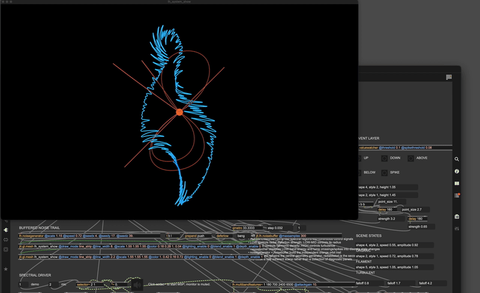
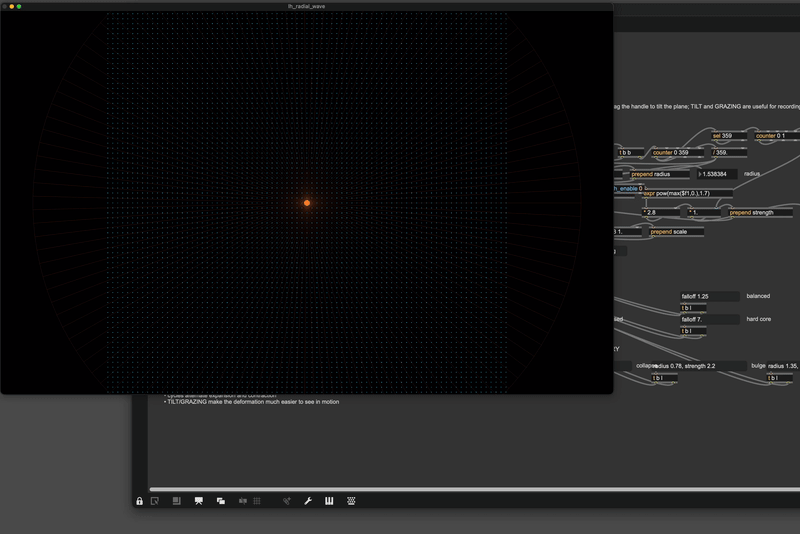
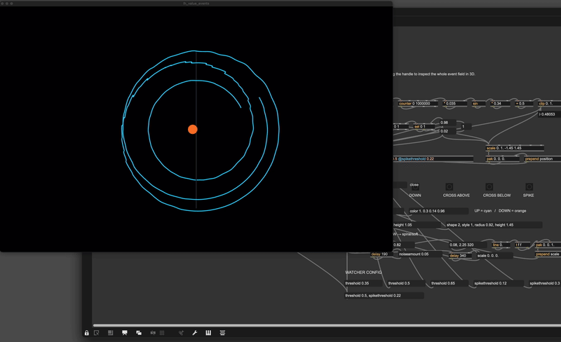
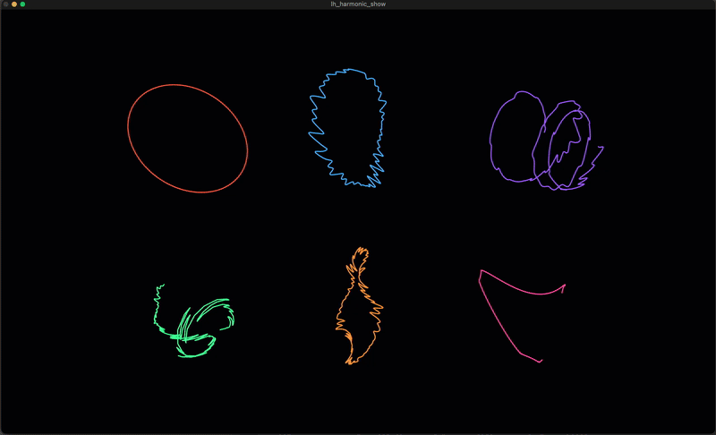

# Procedural Fields

C++ externals for Max/MSP/Jitter: procedural geometry, noise, harmonic motion, control analysis, and audio-reactive features.



## Externals

### Jitter

- `jit.lh.arraylayout`
- `jit.lh.radialdistort`
- `jit.lh.noise3d`
- `jit.lh.fbm3d`
- `jit.lh.harmonicfield`
- `jit.lh.noisebuffer`

### Max

- `lh.noisegenerator`
- `lh.harmonicdeformer`
- `lh.valuewatcher`
- `lh.stats`
- `lh.mix`

### MSP

- `lh.pcmfeatures~`
- `lh.multiband~`
- `lh.multibandfeatures~`

## Download

Prebuilt universal macOS externals (`x86_64 + arm64`) are available in [`externals/`](externals/).

Put the `.mxo` bundles somewhere in Max's search path, or inside your own Max package/folder.

If macOS blocks a downloaded external because of quarantine, remove the quarantine attribute from the downloaded folder:

```bash
xattr -dr com.apple.quarantine /path/to/externals
```

## Showcases







## Status

Shared as-is as part of an ongoing computational practice. No support schedule or compatibility commitment is implied.
